# YZTA Bootcamp - AI Destekli Staj Başvuru Platformu

<div align="center">


**Yapay zeka destekli kişiselleştirilmiş CV ile önyazı oluşturma ve başvuru takip platformu**

[Ürün Özellikleri](#ürün-özellikleri) • [Sprint Planı](#sprint-planı) • [Mimari](#mimari) • [Hızlı Başlangıç](#hızlı-başlangıç) • [API Dokümantasyonu](#api-dokümantasyonu) • [Katkıda Bulunma](#katkıda-bulunma)

</div>

---

Projede, birden fazla iş ilanına başvuran adaylar için yapay zeka destekli bir kariyer platformudur. Her ilanın farklı beklentilerini analiz ederek kullanıcının CV'sini o ilana göre günceller, önyazısını oluşturur ve tüm başvurularını tek bir yerden takip etmesini sağlar.

## Takım İsmi

Takım 44

## Takım Rolleri

| Rol | Kişi | GitHub | LinkedIn |
|-----|------|--------|----------|
| Product Owner | Rumeysa AĞIL | [@Rum-eysa](https://github.com/Rum-eysa) | [@rumeysaagil](https://www.linkedin.com/in/rumeysaagil/) |
| Scrum Master | Serkan YILDIZ | [@Serkan0YLDZ](https://github.com/Serkan0YLDZ) | [@serkan0yldz](https://www.linkedin.com/in/serkan0yldz/) |
| Developer | Zeynep Maide DEMİR | [@zeynepmaidedemir](https://github.com/zeynepmaidedemir) | [@zeynep-maide-demir](https://www.linkedin.com/in/zeynep-maide-demir/) |
| Developer | Filiz Buzkıran | [@lizlavigne](https://github.com/lizlavigne) | [@filizbuzkiran](https://www.linkedin.com/in/filizbuzkiran) |

## Ürün İsmi

CareerTrack - AI destekli kişiselleştirilmiş CV ile önyazı oluşturma ve başvuru takip platformu

## Ürün Açıklaması

Kullanıcılar farklı şirketlere ve pozisyonlara aynı anda başvurabilir; ancak her iş ilanı farklı beceri ve deneyim beklentisi içerir. Platform, ilan metnini yapay zeka ile inceleyerek hangi özelliklerin arandığını çıkarır, kullanıcının o ilanda öne çıkması için CV'sini ilana özel şekilde günceller ve önyazısını oluşturur. Başvurulan tüm ilanlar da platform üzerinden takip edilebilir.

## Problem Tanımı

Birçok iş ilanına başvuran adaylar, her pozisyonun farklı gereksinimleri nedeniyle CV ve önyazılarını tek tek uyarlamak zorunda kalır. Bu süreç zaman alıcıdır ve başvuruların takibi dağınık hale gelebilir. Platform, ilanlardaki beklentileri otomatik analiz ederek adayın her başvuruya uygun dokümanları hazırlamasına ve tüm süreci merkezi olarak yönetmesine yardımcı olur.

## İş Değeri

- Her iş ilanı için CV ve önyazıyı kişiselleştirir.
- İlanda aranan beceri ve deneyimleri net şekilde ortaya çıkarır.
- Adayın ilana uygunluğunu puanlayarak hangi başvurulara öncelik verileceğini gösterir.
- Tüm başvuruları tek platformda takip ederek süreci düzenli hale getirir.

## Ürün Özellikleri

- **AI Destekli İlan Analizi** - Google Gemini ile iş ilanındaki beceri ve deneyim beklentilerini çıkarma.
- **Kişiselleştirilmiş CV Üretimi** - Her ilana özel, öne çıkmayı hedefleyen CV güncellemesi.
- **Otomatik Önyazı** - İlan ve profil bilgisine göre önyazı oluşturma.
- **Başvuru Takibi** - Başvurulan tüm iş ilanlarını aşama ve durum bazında izleme.
- **Güvenli Kimlik Doğrulama** - JWT tabanlı kimlik doğrulama ve bcrypt şifreleme.
- **Yüksek Performans** - Redis önbellekleme katmanı ile asenkron işleme.
- **İzlenebilirlik** - Yapılandırılmış loglama ve istek takibi.
- **Kurumsal Güvenlik** - CORS, hız sınırlama, güvenlik başlıkları ve giriş doğrulama.
- **Kapsamlı Testler** - Yüksek kapsamlı birim ve entegrasyon testleri.
- **Sürekli Entegrasyon / Dağıtım** - GitHub Actions ile otomatik test ve dağıtım.
- **Veritabanı Göçleri** - Alembic ile versiyon kontrollü şema değişiklikleri.
- **Modern Arayüz** - TailwindCSS ve Next.js ile duyarlı kullanıcı arayüzü.

## Hedef Kitle

- Staj ve iş arayan öğrenciler
- Birden fazla pozisyona eş zamanlı başvuran adaylar
- Bootcamp ve kariyer geliştirme programı katılımcıları
- CV ve önyazısını her ilana göre uyarlamak isteyen kullanıcılar

## Ürün Backlog'u

Proje backlog bilgileri GitHub Projects üzerinden yönetilmektedir:

- [GitHub Projects Backlog](https://github.com/users/Rum-eysa/projects/6/views/1?groupedBy%5BcolumnId%5D=364119553)
- Sprint planları ve görev takibi burada güncellenmektedir
- Sprint 1 detayları için [Sprint 1](#sprint-1), Sprint 2 için [Sprint 2](#sprint-2) bölümüne bakınız
- Sprint 2 yapılan/eksik listesi: [`docs/Sprint-2-Yapilanlar-ve-Eksikler.md`](docs/Sprint-2-Yapilanlar-ve-Eksikler.md)

## Sprint Planı

### Sprint 1

<details id="sprint-1">
<summary><strong>Sprint 1 detayları için tıklayın</strong></summary>

<br>

- **Product Backlog:** Backlog ve sprint görevleri [GitHub Projects](https://github.com/users/Rum-eysa/projects/6/views/1?groupedBy%5BcolumnId%5D=364119553) üzerinden yönetilmektedir. User story'ler `[US-00X]` formatında tanımlanmış; Status sütununda Todo, In Progress ve Done durumları takip edilmektedir.

  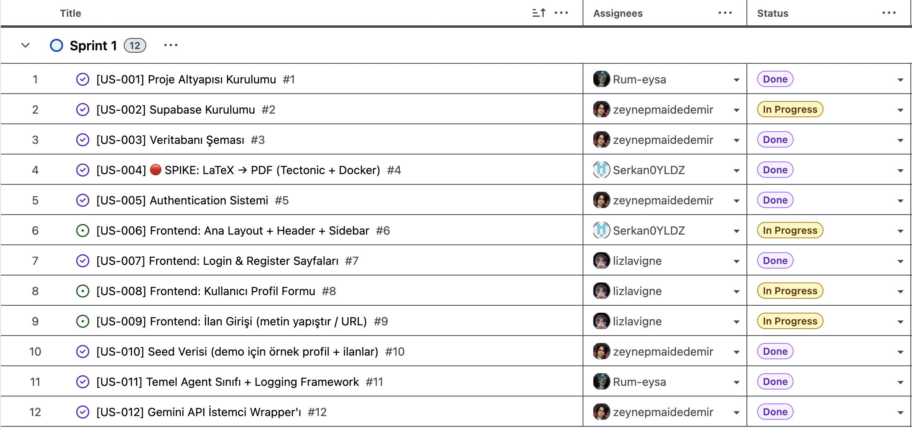

- **Sprint Puanlaması:** Sprint 1 planı (19 Haziran – 5 Temmuz) toplam **62 story point** (12 user story). Story point'ler görev karmaşıklığına göre planlanmıştır (3–8 SP arası). Kod denetimi sonucu: **12 story tamamlandı** — kazanılan **62 / 62 SP (%100)**. 

  | Story | Başlık | SP | Öncelik | Durum | Kazanılan |
  | ----- | ------ | -- | ------- | ----- | --------- |
  | US-001 | Proje Altyapısı Kurulumu | 8 | must-have | ✅ Tamamlandı | 8 |
  | US-002 | Supabase Kurulumu | 5 | must-have | ✅ Tamamlandı | 5 |
  | US-003 | Veritabanı Şeması | 5 | must-have | ✅ Tamamlandı | 5 |
  | US-004 | SPIKE: LaTeX → PDF (Tectonic + Docker) | 8 | must-have | ✅ Tamamlandı | 8 |
  | US-005 | Authentication Sistemi | 5 | must-have | ✅ Tamamlandı | 5 |
  | US-006 | Frontend: Ana Layout + Header + Sidebar | 5 | must-have | ✅ Tamamlandı | 5 |
  | US-007 | Frontend: Login & Register Sayfaları | 5 | must-have | ✅ Tamamlandı | 5 |
  | US-008 | Frontend: Kullanıcı Profil Formu | 5 | high | ✅ Tamamlandı | 5 |
  | US-009 | Frontend: İlan Girişi (metin / URL) | 3 | must-have | ✅ Tamamlandı | 3 |
  | US-010 | Seed Verisi | 3 | high | ✅ Tamamlandı | 3 |
  | US-011 | Temel Agent Sınıfı + Logging Framework | 5 | high | ✅ Tamamlandı | 5 |
  | US-012 | Gemini API İstemci Wrapper'ı | 5 | must-have | ✅ Tamamlandı | 5 |
  |  | **Toplam** | **62** |  | **12 tamamlandı** | **62** |

  **Özet:** Planlanan 62 SP’nin tamamı kazanıldı (**62 / 62, %100**). Sprint 1 kapsamı dışında erken tamamlanan bonus işler: 4 AI agent modülü, `POST /api/analyze`, MinIO depolama (~62 pytest).

- **Daily Scrum:** Ekip 2 günde bir Slack Huddle üzerinden senkron toplantı yapmıştır. 

  *AI / Backend ilerleme paylaşımı — Zeynep'in agent sunumu:*

  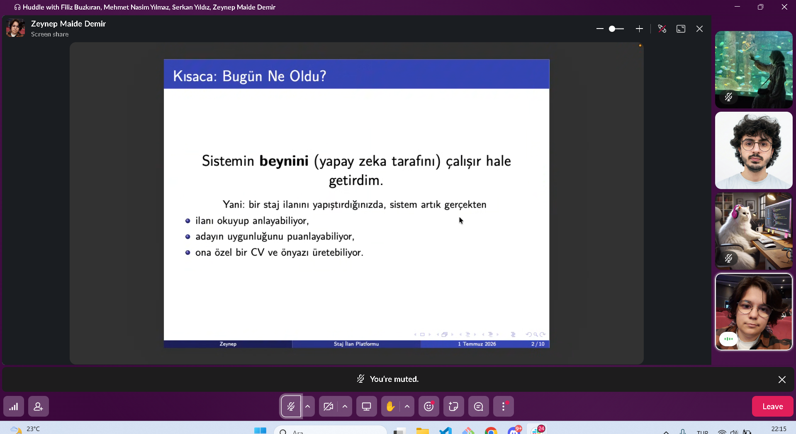

  *Frontend ilerleme paylaşımı — Serkan'ın UI prototip sunumu:*

  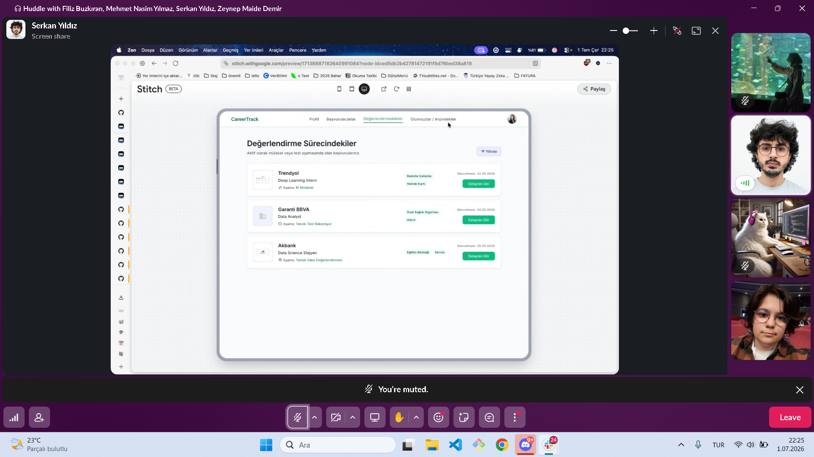

- **Ürün Geliştirme Durumu:** Backend ve AI tarafında ilan analizi, aday uygunluk puanlama, kişiselleştirilmiş CV ve önyazı üretimi çalışır durumdadır (`POST /api/analyze`, Gemini client, agent framework, MinIO PDF depolama). Frontend tarafında CareerTrack arayüzünün profil ve ilan ekleme ekranları hazırlanmıştır; Next.js'te temel sayfalar mevcuttur (`login`, `register`, `profile`, `apply`).

  *Profil sayfası — kullanıcı bilgileri, özet ve beceriler:*

  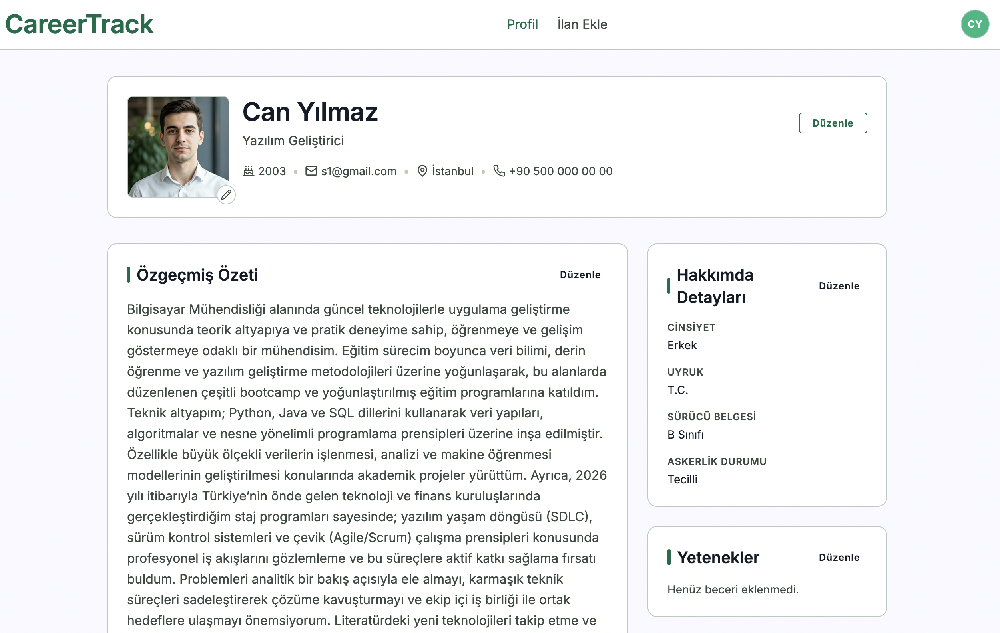

  *İlan ekleme sayfası — şirket, pozisyon ve ilan detayları:*

  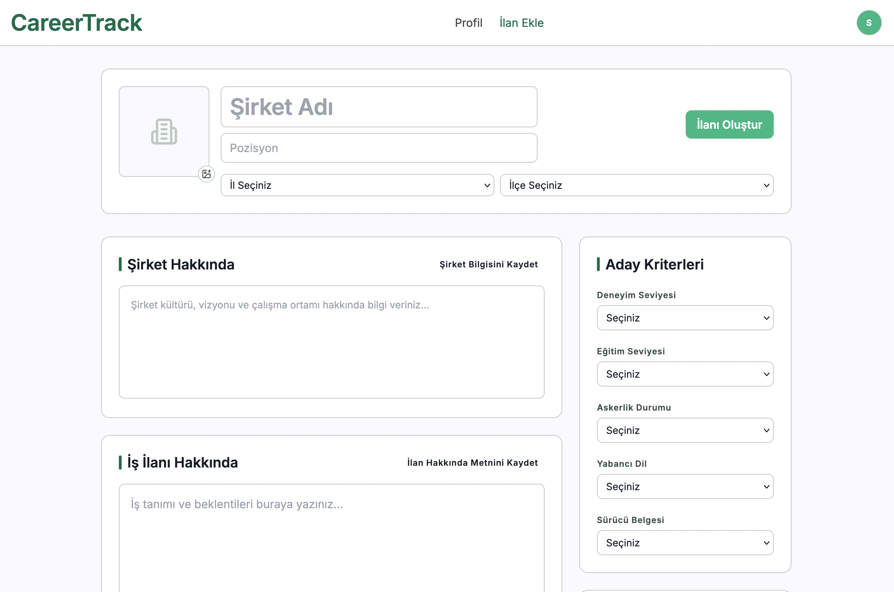

- **Sprint Review:** Sprint 1 hedeflerinin tamamı kapanmıştır (**62 / 62 SP, %100**). Çıkan ürün testlerde kritik bir sorun göstermemiştir. 

  **Tamamlananlar:**
  - Monorepo altyapısı: FastAPI + Next.js + Docker Compose (PostgreSQL, Redis, MinIO)
  - Supabase/PostgreSQL şeması: `users`, `job_listings`, `matches`, `documents`
  - JWT authentication, Redis token blacklist, seed verisi (`make seed`)
  - AI agent katmanı: ilan analizi, eşleştirme, CV üretimi (Tectonic PDF), önyazı üretimi
  - `POST /api/analyze`, `PATCH /api/profiles/me`, Gemini client (rate limit, token tracking)
  - CareerTrack frontend: layout, login/register, profil ve ilan ekleme sayfaları; ilan analizi API entegrasyonu

  **Alınan kararlar:**
  - US-004: Standalone compiler kaldırıldı; Tectonic API Docker image içine gömüldü
  - `applications` CRUD yerine agent odaklı veri modeli benimsendi
  - İlan analizi ve üretilen dokümanlar veritabanında kalıcı olarak saklanır; kullanıcı akışı kanonik ilan detay rotasına yönlenir
  - CV/önyazı üretimi backend'de hazır; kullanıcı arayüzüne uçtan uca entegrasyon Sprint 2 kapsamına alındı

- **Sprint Retrospective:** 

  - **İyi giden:** Backend ve agent altyapısı erken tamamlandı.
  - **İyileştirme:** GitHub Projects board'u sprint sonu koxwd durumuyla senkron tutuldu.
  - **İyileştirme:** Kısmi story'lerde eksik AC'ler Sprint 2 borç listesine taşındı (~8 SP).
  - **Sprint 2 planlandı:** Sprint 1 retrospective sonrası Sprint 2 backlog'u revize edildi.

</details>

### Sprint 2

<details id="sprint-2">
<summary><strong>Sprint 2 detayları için tıklayın</strong></summary>

<br>

- **Product Backlog:** Sprint 2 görevleri [GitHub Projects](https://github.com/users/Rum-eysa/projects/6/views/1?groupedBy%5BcolumnId%5D=364119553) üzerinden yönetilmiştir. Sprint 1 borçları (`US-002†`…`US-010†`), çekirdek agent/UI story’leri (`US-013`…`US-035`) ve wishlist/borç kartları (`US-036`…`US-042`) bu sprintte takip edilmiştir.

  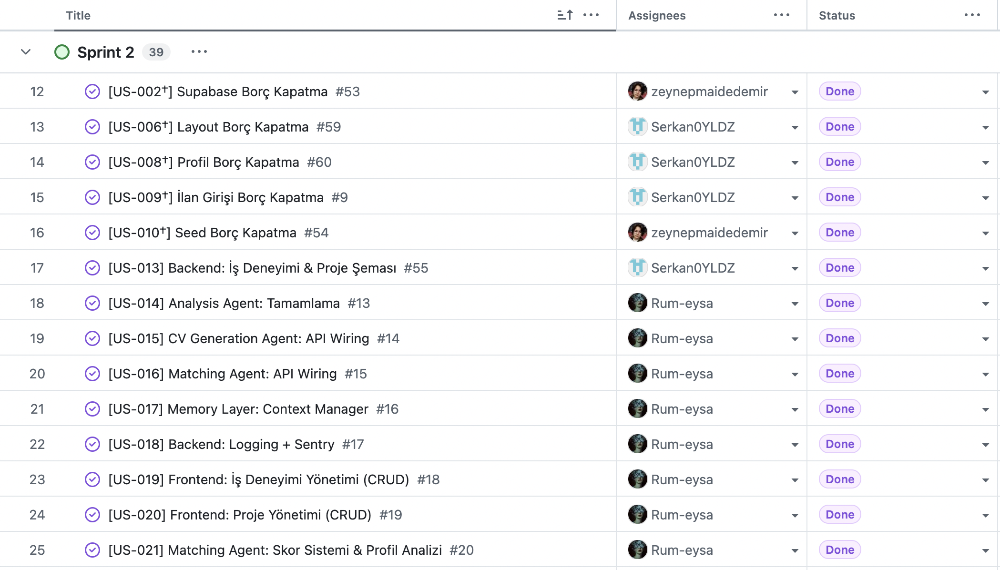

- **Sprint Puanlaması:** Sprint 2 planı toplam **~90 story point** (35 user story: borç + çekirdek + US-036…042). Kod denetimi sonucu: **35 story tamamlandı** — kazanılan **~90 / 90 SP (%100)**.


<table width="100%">
<thead>
<tr>
<th width="12%">Story</th>
<th width="40%">Başlık</th>
<th width="8%">SP</th>
<th width="12%">Öncelik</th>
<th width="18%">Durum</th>
<th width="10%">Kazanılan</th>
</tr>
</thead>
<tbody>
<tr>
<td>US-002†</td>
<td>Supabase Borç Kapatma</td>
<td>2</td>
<td>must-have</td>
<td>✅ Tamamlandı</td>
<td>2</td>
</tr>
<tr>
<td>US-006†</td>
<td>Layout Borç Kapatma</td>
<td>2</td>
<td>must-have</td>
<td>✅ Tamamlandı</td>
<td>2</td>
</tr>
<tr>
<td>US-008†</td>
<td>Profil Borç Kapatma</td>
<td>2</td>
<td>must-have</td>
<td>✅ Tamamlandı</td>
<td>2</td>
</tr>
<tr>
<td>US-009†</td>
<td>İlan Girişi Borç Kapatma</td>
<td>1</td>
<td>must-have</td>
<td>✅ Tamamlandı</td>
<td>1</td>
</tr>
<tr>
<td>US-010†</td>
<td>Seed Borç Kapatma</td>
<td>1</td>
<td>high</td>
<td>✅ Tamamlandı</td>
<td>1</td>
</tr>
<tr>
<td>US-013</td>
<td>İş Deneyimi & Proje Şeması</td>
<td>3</td>
<td>must-have</td>
<td>✅ Tamamlandı</td>
<td>3</td>
</tr>
<tr>
<td>US-014</td>
<td>Analysis Agent: Tamamlama</td>
<td>1</td>
<td>must-have</td>
<td>✅ Tamamlandı</td>
<td>1</td>
</tr>
<tr>
<td>US-015</td>
<td>CV Generation Agent: API Wiring</td>
<td>2</td>
<td>must-have</td>
<td>✅ Tamamlandı</td>
<td>2</td>
</tr>
<tr>
<td>US-016</td>
<td>Matching Agent: API Wiring</td>
<td>2</td>
<td>must-have</td>
<td>✅ Tamamlandı</td>
<td>2</td>
</tr>
<tr>
<td>US-017</td>
<td>Memory Layer: Context Manager</td>
<td>2</td>
<td>high</td>
<td>✅ Tamamlandı</td>
<td>2</td>
</tr>
<tr>
<td>US-018</td>
<td>Logging + Sentry</td>
<td>2</td>
<td>high</td>
<td>✅ Tamamlandı</td>
<td>2</td>
</tr>
<tr>
<td>US-019</td>
<td>Frontend: İş Deneyimi CRUD</td>
<td>4</td>
<td>must-have</td>
<td>✅ Tamamlandı</td>
<td>4</td>
</tr>
<tr>
<td>US-020</td>
<td>Frontend: Proje CRUD</td>
<td>2</td>
<td>high</td>
<td>✅ Tamamlandı</td>
<td>2</td>
</tr>
<tr>
<td>US-021</td>
<td>Matching: Skor Sistemi</td>
<td>3</td>
<td>must-have</td>
<td>✅ Tamamlandı</td>
<td>3</td>
</tr>
<tr>
<td>US-022</td>
<td>Cover Letter Agent: API Wiring</td>
<td>3</td>
<td>high</td>
<td>✅ Tamamlandı</td>
<td>3</td>
</tr>
<tr>
<td>US-023</td>
<td>API: <code>/api/match</code></td>
<td>2</td>
<td>must-have</td>
<td>✅ Tamamlandı</td>
<td>2</td>
</tr>
<tr>
<td>US-024</td>
<td>Score Gauge (ilan detay)</td>
<td>5</td>
<td>must-have</td>
<td>✅ Tamamlandı</td>
<td>5</td>
</tr>
<tr>
<td>US-025</td>
<td>API: generate-cv & cover-letter</td>
<td>2</td>
<td>high</td>
<td>✅ Tamamlandı</td>
<td>2</td>
</tr>
<tr>
<td>US-026</td>
<td>Skill Comparison Table</td>
<td>5</td>
<td>high</td>
<td>✅ Tamamlandı</td>
<td>5</td>
</tr>
<tr>
<td>US-027</td>
<td>CV Preview + Download</td>
<td>3</td>
<td>high</td>
<td>✅ Tamamlandı</td>
<td>3</td>
</tr>
<tr>
<td>US-028</td>
<td>Cover Letter View</td>
<td>3</td>
<td>high</td>
<td>✅ Tamamlandı</td>
<td>3</td>
</tr>
<tr>
<td>US-029</td>
<td>Job Form → <code>/api/analyze</code></td>
<td>2</td>
<td>must-have</td>
<td>✅ Tamamlandı</td>
<td>2</td>
</tr>
<tr>
<td>US-030</td>
<td>Orchestrator</td>
<td>5</td>
<td>must-have</td>
<td>✅ Tamamlandı</td>
<td>5</td>
</tr>
<tr>
<td>US-031</td>
<td>API E2E Testler</td>
<td>1</td>
<td>must-have</td>
<td>✅ Tamamlandı</td>
<td>1</td>
</tr>
<tr>
<td>US-032</td>
<td>Results API Integration</td>
<td>4</td>
<td>must-have</td>
<td>✅ Tamamlandı</td>
<td>4</td>
</tr>
<tr>
<td>US-033</td>
<td>Agent Unit Tests (%80+)</td>
<td>2</td>
<td>high</td>
<td>✅ Tamamlandı</td>
<td>2</td>
</tr>
<tr>
<td>US-034</td>
<td>E2E Integration Tests</td>
<td>5</td>
<td>high</td>
<td>✅ Tamamlandı</td>
<td>5</td>
</tr>
<tr>
<td>US-035</td>
<td>Staging Deploy</td>
<td>3</td>
<td>high</td>
<td>✅ Tamamlandı</td>
<td>3</td>
</tr>
<tr>
<td>US-036</td>
<td>Kaydet Butonu UX</td>
<td>2</td>
<td>high</td>
<td>✅ Tamamlandı</td>
<td>2</td>
</tr>
<tr>
<td>US-037</td>
<td>Yeniden Analiz & Eşleştirme</td>
<td>5</td>
<td>must-have</td>
<td>✅ Tamamlandı</td>
<td>5</td>
</tr>
<tr>
<td>US-038</td>
<td>Zengin Seed</td>
<td>2</td>
<td>high</td>
<td>✅ Tamamlandı</td>
<td>2</td>
</tr>
<tr>
<td>US-039</td>
<td><code>/results</code> → <code>/listings/:id</code></td>
<td>3</td>
<td>must-have</td>
<td>✅ Tamamlandı</td>
<td>3</td>
</tr>
<tr>
<td>US-040</td>
<td>Match sahiplik kontrolü</td>
<td>1</td>
<td>high</td>
<td>✅ Tamamlandı</td>
<td>1</td>
</tr>
<tr>
<td>US-041</td>
<td>Orchestrator sıra/retry uyumu</td>
<td>2</td>
<td>medium</td>
<td>✅ Tamamlandı</td>
<td>2</td>
</tr>
<tr>
<td>US-042</td>
<td>CV route 422/503 testleri</td>
<td>1</td>
<td>high</td>
<td>✅ Tamamlandı</td>
<td>1</td>
</tr>
<tr>
<td></td>
<td><strong>Toplam</strong></td>
<td><strong>~90</strong></td>
<td></td>
<td><strong>35 tamamlandı</strong></td>
<td><strong>~90</strong></td>
</tr>
</tbody>
</table>

  **Özet:** Planlanan ~90 SP’nin tamamı kazanıldı (**~90 / 90, %100**). Sprint 1 sonrası öne çıkanlar: tek kanonik ilan detay sayfası, eşleşme/CV/önyazı uçtan uca UI, deneyim-proje CRUD, ContextManager + Orchestrator, yeniden analiz/eşleştirme, zengin seed, staging deploy ve agent test coverage gate.

- **Daily Scrum:** Ekip Slack Huddle üzerinden senkron toplantı yapmıştır.

  *Profil / frontend ilerleme paylaşımı — Serkan’ın ekran paylaşımı:*

  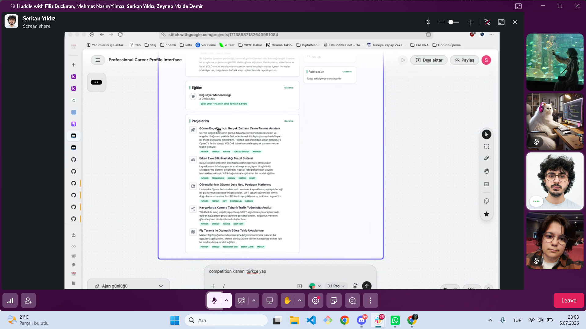

  *Ana sayfada yapılabilecek değişikliklerin konuşulması — Serkan’ın ekran paylaşımı:*

  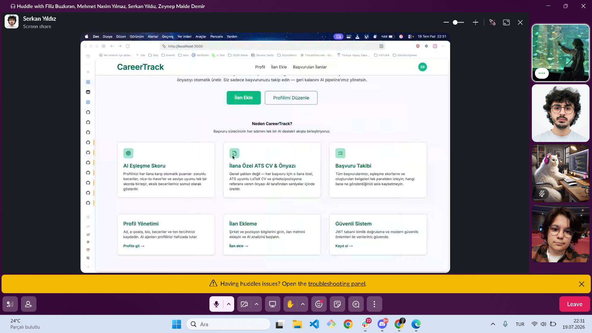

- **Ürün Geliştirme Durumu:** CareerTrack artık ilan eklemeden sonuç üretimine kadar tek akışta çalışır. `/apply` → analiz → `/listings/:id` üzerinde skor gauge, beceri karşılaştırması, ilana özel CV (önizle/indir) ve önyazı (üret/kopyala) sunulur; ilan değişince yeniden analiz ve eşleşme güncellenebilir. Profilde iş deneyimi ve proje CRUD, seed ile demo verisi, Railway/Vercel staging hazırdır.

  *Giriş ekranı:*

  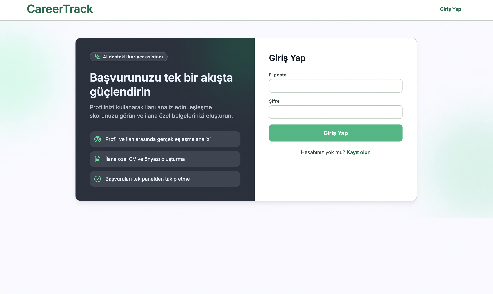

  *Profil — deneyim, eğitim ve projeler:*

  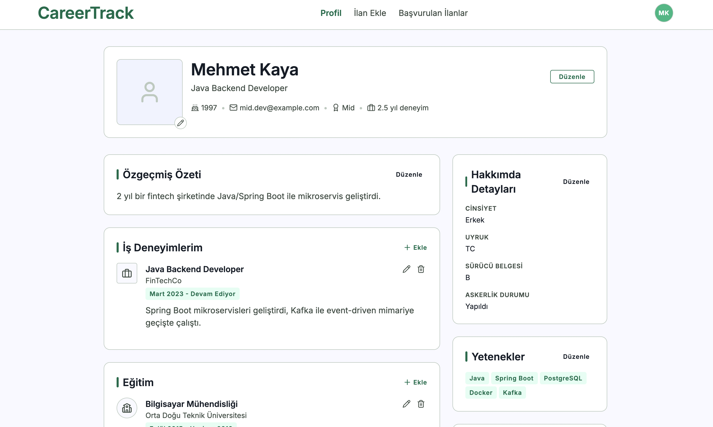

  *Başvurulan ilanlar listesi:*

  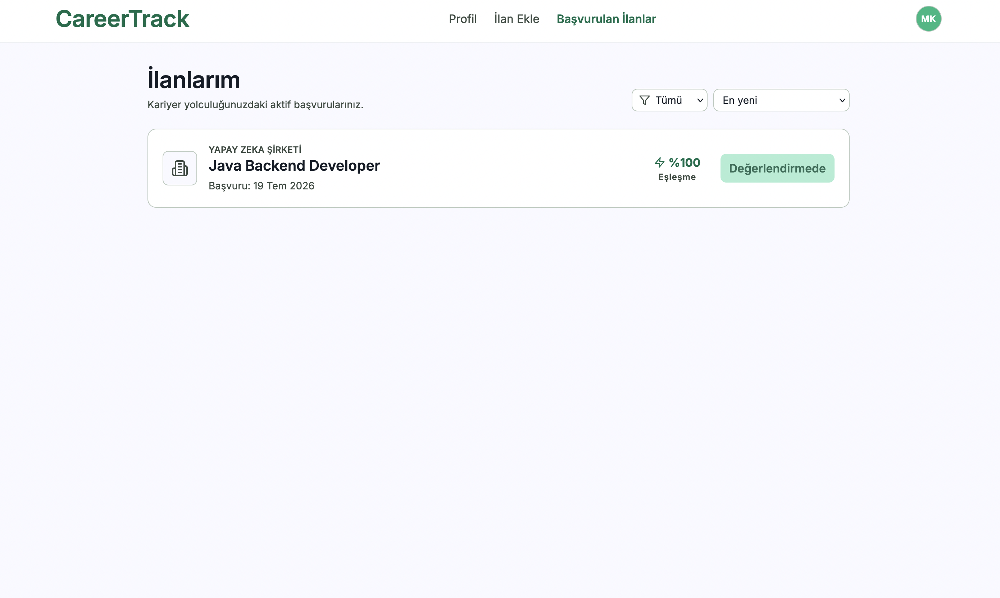

  *İlan detay — düzenleme, skor özeti ve Yeniden Analiz:*

  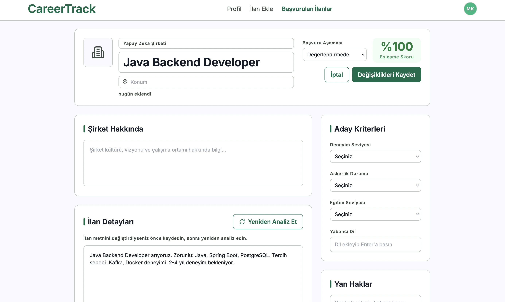

  *Uygunluk sonucu — skor gauge ve beceri tablosu:*

  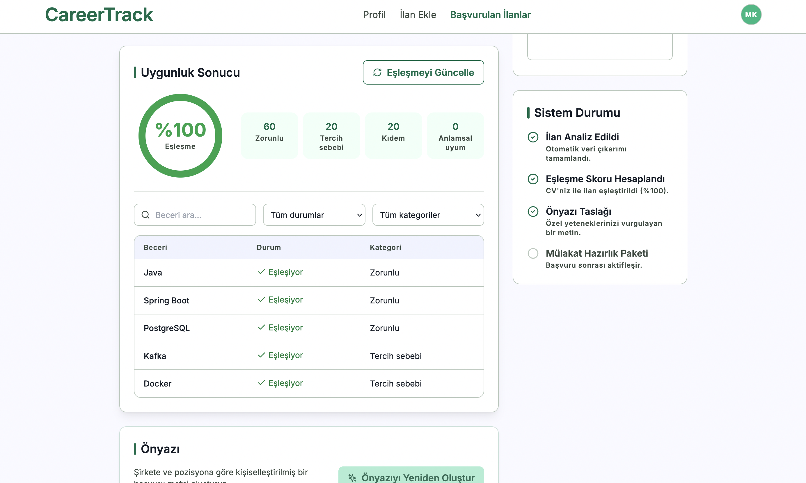

  *İlana özel CV önizleme / indirme:*

  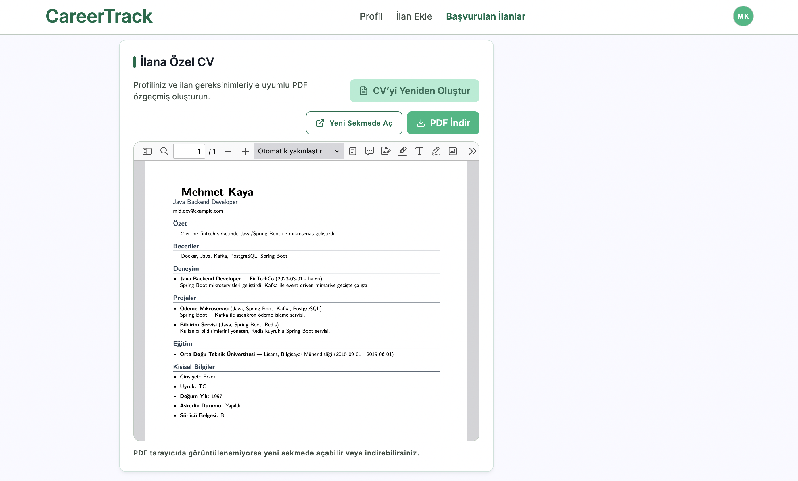

  *Önyazı üretimi — kopyala ve sayaç:*

  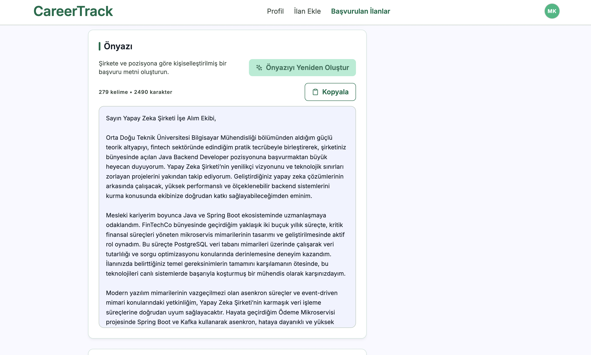

- **Sprint Review:** Sprint 2 hedeflerinin tamamı kapanmıştır (**~90 / 90 SP, %100**).

  **Tamamlananlar:**
  - Sprint 1 borçları: layout/sidebar, profil alanları, ilan girişi, seed (matches/documents + zengin profil verisi), Supabase kapsam dokümantasyonu
  - Backend: iş deneyimi/proje şeması + CRUD; ContextManager; Orchestrator (`POST /api/process`); `POST /api/match`, `generate-cv`, `generate-cover-letter`; ilan sahipliği; reanalyze/rematch + `analyzed_at`
  - Frontend: tek sayfa `/listings/:id` (US-039); skor gauge, beceri tablosu, CV önizleme, önyazı view; landing fark vurgusu
  - Kalite: agent unit testleri + CI `%80` gate, E2E entegrasyon testleri, Sentry/observability
  - Deploy: Railway backend + Vercel frontend; `docs/deploy.md` / `docs/DEPLOY_STAGING.md`

  **Alınan kararlar:**
  - `/results` tamamen kaldırıldı; kanonik rota `/listings/:id`
  - İlan değişince otomatik yeniden skor yok — kullanıcı **Yeniden Analiz Et** / **Eşleşmeyi Güncelle** ile tetikler (US-037)
  - ATS odaklı LaTeX şablon yenileme ve CV’ye sertifika/dil/sosyal alanların tam aktarımı Sprint 3’e alındı (US-043/044)
  - Staging/production URL’leri demo için donduruldu; UAT checklist Sprint 3’te kapanacak

- **Sprint Retrospective:**

  - **İyi giden:** Agent API’ler ile frontend sonuç UI’si aynı sprintte birleşti; board’daki Done kartları ürünle hizalandı.
  - **İyileştirme:** Wishlist maddeleri yeni story (US-036…042) olarak açıldı; 
  - **Sprint 3 planlandı:** ATS CV şablonu, tam profil→CV, UAT ve demo prova.

</details>

### Sprint 3


## Mimari

```
.
├── apps/
│   ├── api/                         # FastAPI Backend Service
│   │   ├── app/
│   │   │   ├── main.py              # Application entry point
│   │   │   ├── config.py            # Configuration management
│   │   │   ├── database.py          # Database connection
│   │   │   ├── models/              # SQLAlchemy ORM (User, JobListing, Match, Document)
│   │   │   ├── routes/              # API endpoints
│   │   │   │   ├── auth.py          # Authentication (/api/auth)
│   │   │   │   ├── users.py         # User management (/api/users)
│   │   │   │   ├── profiles.py      # Profile update (/api/profiles)
│   │   │   │   ├── analysis.py      # İlan analizi (/api/analyze)
│   │   │   │   ├── agents.py        # Agent task API (/api/agents)
│   │   │   │   └── health.py        # Health checks (/health)
│   │   │   ├── services/            # Business logic layer
│   │   │   │   ├── auth.py          # JWT, token blacklist
│   │   │   │   ├── user.py          # User service
│   │   │   │   ├── agent.py         # Agent task orchestration
│   │   │   │   ├── gemini_client.py # Google Gemini wrapper
│   │   │   │   ├── storage.py       # MinIO PDF depolama
│   │   │   │   └── listing_fetch.py # URL'den ilan metni çekme
│   │   │   ├── agents/              # AI agent modülleri
│   │   │   │   ├── listing_analysis.py
│   │   │   │   ├── matching.py
│   │   │   │   ├── cv_generation.py
│   │   │   │   └── cover_letter.py
│   │   │   ├── repositories/        # Veritabanı erişim katmanı
│   │   │   └── schemas/             # Pydantic request/response modelleri
│   │   ├── scripts/
│   │   │   └── seed_database.py     # Demo verisi (US-010)
│   │   ├── tests/                   # Test suite
│   │   ├── alembic/                 # Database migrations
│   │   └── Dockerfile
│   │
│   └── web/                         # Next.js Frontend Service
│       ├── app/                     # App Router
│       │   ├── page.tsx             # Landing page
│       │   ├── login/               # Giriş
│       │   ├── register/            # Kayıt
│       │   ├── profile/             # Profil formu
│       │   ├── apply/               # İlan girişi
│       │   └── listings/[listingId]/ # Kalıcı ilan ve analiz detayları
│       ├── components/              # UI ve layout bileşenleri
│       ├── lib/api/                 # Endpoint bazlı API istemcileri
│       ├── components/providers/    # Auth ve React Query sağlayıcıları
│       └── Dockerfile
│
├── docs/sprint-1/                   # Sprint 1 dokümantasyon görselleri
├── docs/sprint-2/                   # Sprint 2 dokümantasyon görselleri
├── docs/Sprint-2-Yapilanlar-ve-Eksikler.md  # Sprint 2 yapılan / eksik listesi
├── .github/workflows/ci.yml         # CI/CD pipeline
├── docker-compose.yml               # Development (postgres, redis, minio, api, web)
├── docker-compose.prod.yml          # Production environment
├── Makefile                         # Command shortcuts
└── ...
```

### Teknoloji Stack

| Katman | Teknoloji | Amaç |
| --- | --- | --- |
| **Frontend** | Next.js 14, React 18, TypeScript, TailwindCSS, TanStack React Query | Duyarlı arayüz ve sunucu durumu yönetimi |
| **Backend** | FastAPI, SQLAlchemy 2.0, Pydantic V2 | Yüksek performanslı async API |
| **Veritabanı** | PostgreSQL 15 / Supabase | Ana veri depolama |
| **Önbellek** | Redis 7 | Token blacklist ve önbellekleme |
| **Depolama** | MinIO (S3 uyumlu) | CV PDF dosya depolama |
| **AI/ML** | Google Gemini | İlan analizi, eşleştirme, CV ve önyazı üretimi |
| **PDF** | Tectonic (API image içinde) | LaTeX → PDF derleme |
| **Altyapı** | Docker, Docker Compose | Konteyner orkestrasyonu |
| **Test** | Pytest, pytest-asyncio, Coverage | Birim ve entegrasyon testleri |
| **CI/CD** | GitHub Actions | Otomatik test ve build |
| **Kod Kalitesi** | Black, isort, flake8, mypy, pre-commit | Linting ve formatlama |

### Frontend veri akışı

`POST /api/analyze` başarılı olduğunda arayüz doğrudan
`/listings/{listing_id}` rotasına gider. Bu kanonik sayfa ilanı
`GET /api/listings/{listing_id}` ile veritabanından yükler; eşleştirme, yeniden analiz,
CV ve önyazı mutasyonları React Query önbelleğini güncelledikten sonra aynı ilan
sorgusunu geçersiz kılar. Böylece sayfa yenilendiğinde tüm kalıcı veriler API'den
yeniden alınır.

## Hızlı Başlangıç

### Gereksinimler

- Docker & Docker Compose 20.10+
- Git
- Node.js 18+ (local development için)

### Kurulum

```bash
# Repository'yi klonla
git clone https://github.com/Rum-eysa/YZTA-bootcamp-Team-44
cd YZTA-bootcamp-Team-44

# Environment değişkenlerini yapılandır
cp .env.example .env

# Tüm servisleri başlat
make build && make up

# Veritabanı tablolarını oluştur
make migrate

# (İsteğe bağlı) Demo kullanıcıları yükle
make seed
```

### Demo Hesaplar

`make seed` sonrası aşağıdaki hesaplarla giriş yapılabilir (tümü için şifre: `seedpass123`):

| E-posta | Seviye | Hedef Pozisyon |
| --- | --- | --- |
| `junior.dev@example.com` | junior | Python Backend Developer Intern |
| `mid.dev@example.com` | mid | Java Backend Developer |
| `ai.engineer@example.com` | senior | AI Engineer |
| `fullstack.multi@example.com` | mid | Full Stack Developer |
| `senior.dev@example.com` | senior | Senior Backend Engineer |

Her hesapta iş deneyimi, proje, eğitim ve sertifika kayıtları önceden dolu gelir; diğer seed kullanıcıları için bkz. `apps/api/scripts/seed_database.py`.

### Staging / Canlı Ortam

Staging kurulum rehberi için [`docs/DEPLOY_STAGING.md`](docs/DEPLOY_STAGING.md), canlı URL'ler ve go-live kontrol listesi için [`docs/deploy.md`](docs/deploy.md).

### Erişim Noktaları

- **Frontend**: https://yzta-bootcamp-team-44.vercel.app
- **Backend API**: yzta-bootcamp-team-44-production.up.railway.app/docs
- **API Dokümantasyonu**: https://yzta-bootcamp-team-44-production.up.railway.app/docs
- **ReDoc**: https://yzta-bootcamp-team-44-production.up.railway.app/redoc

## Geliştirme

### Kullanılabilir Komutlar

```bash
# Servisleri başlat
make up

# Logları görüntüle
make logs

# Testleri çalıştır
make test

# Servisleri durdur
make down

# Tüm ortamı temizle
make clean

# Production deployment
make prod-up
```

Daha fazla komut için [Makefile](./Makefile) dosyasını inceleyebilirsiniz.

### Ortam Yapılandırması

Örnek ortam dosyasını kopyalayın:

```bash
cp .env.example .env
```

**Önemli üretim ayarları:**
- `JWT_SECRET`: Güçlü bir gizli anahtar (32+ karakter)
- `SUPABASE_DB_URL` veya `DB_PASSWORD`: Veritabanı bağlantısı
- `GEMINI_API_KEY`: Geçerli bir Google Gemini API anahtarı
- `MINIO_ROOT_USER` / `MINIO_ROOT_PASSWORD`: MinIO kimlik bilgileri
- `DEBUG`: `false` olarak ayarlayın
- `ENVIRONMENT`: `production` olarak ayarlayın

## Veritabanı Yönetimi

Veritabanı migration Alembic ile yönetilir:

```bash
# Yeni migration oluştur
docker-compose exec api alembic revision --autogenerate -m "açıklama"

# Migration'ları uygula
docker-compose exec api alembic upgrade head

# Bir migration geri al
docker-compose exec api alembic downgrade -1
```

## Testler

```bash
# Tüm testleri çalıştır
make test

# Coverage raporu oluştur
docker-compose exec api pytest tests/ --cov=app --cov-report=html
```

## API Dokümantasyonu

- **Swagger UI**: https://yzta-bootcamp-team-44-production.up.railway.app/docs
- **ReDoc**: https://yzta-bootcamp-team-44-production.up.railway.app/redoc

## Code Quality

### Pre-commit Hooks

```bash
pip install pre-commit
pre-commit install
```

### Manuel Linting

```bash
# Python (apps/api dizininde)
cd apps/api
black app/
isort app/
flake8 app/
mypy app/

# Frontend
cd apps/web
npm run lint
```

## Production Deployment

```bash
docker-compose -f docker-compose.prod.yml up -d
```

### Production Kontrol Listesi

- [ ] Environment değişkenleri yapılandırıldı
- [ ] `JWT_SECRET` güçlü değerle değiştirildi
- [ ] `DEBUG` `false` olarak ayarlandı
- [ ] Database yedeği alındı
- [ ] Migration'lar uygulandı
- [ ] Tüm testler geçti
- [ ] Health check endpoint çalışıyor

## API Endpoint'leri

Tüm API route'ları `/api` prefix'i altında tanımlıdır (health hariç).

### Authentication
- `POST /api/auth/register` - Kullanıcı kaydı
- `POST /api/auth/login` - Kullanıcı girişi (JWT)
- `POST /api/auth/refresh` - Token yenileme
- `POST /api/auth/logout` - Çıkış (Redis token blacklist)

### Users
- `GET /api/users/me` - Mevcut kullanıcı profili
- `PUT /api/users/me` - Kullanıcı profili güncelleme
- `GET /api/users/{user_id}` - Kullanıcı bilgisi

### Profiles
- `PATCH /api/profiles/me` - Profil güncelleme (US-008)

### Analysis
- `POST /api/analyze` - İlan metni veya URL analizi (AI)

### Matching & Documents (Sprint 2)
- `POST /api/match` - Profil ↔ ilan eşleştirme skoru (cache'li)
- `POST /api/generate-cover-letter` - Şirkete özel önyazı üretimi (AI)
- `POST /api/generate-cv` - İlana özel PDF CV üretimi (LaTeX/Tectonic)

### Agents
- `POST /api/agents/tasks` - Agent görevi oluşturma
- `GET /api/agents/tasks/{task_id}` - Görev durumu
- `GET /api/agents/status` - Agent sistemi durumu

### Health
- `GET /health` - Health check
- `GET /health/ready` - Readiness probe

## Agent Sistemi

Sprint 1'de temel agent altyapısı ve dört AI modülü devreye alınmıştır:

- **İlan Analizi** — İş ilanındaki beceri ve deneyim beklentilerini çıkarır
- **Eşleştirme** — Aday profili ile ilan arasında uygunluk puanı hesaplar
- **CV Üretimi** — İlana özel CV oluşturur ve PDF olarak MinIO'ya kaydeder
- **Önyazı Üretimi** — Profil ve ilan bilgisine göre önyazı metni üretir

Agent görevleri `POST /api/agents/tasks` üzerinden tetiklenebilir; Gemini client rate limiting ve token tracking ile çalışır.

## Katkıda Bulunma

Katkılarınızı bekliyoruz! Lütfen yönergeler için [CONTRIBUTING.md](./CONTRIBUTING.md) dosyasını okuyun.

## Lisans

Bu proje MIT Lisansı altında lisanslanmıştır - detaylar için [LICENSE](./LICENSE) dosyasına bakın.

## Destek

Sorularınız ve desteğiniz için GitHub'da issue açabilirsiniz.

---

<div align="center">

**Built with ❤️ by YZTA Bootcamp Team 44**

[⬆ Başa Dön](#yzta-bootcamp---ai-destekli-staj-başvuru-platformu)

</div>
